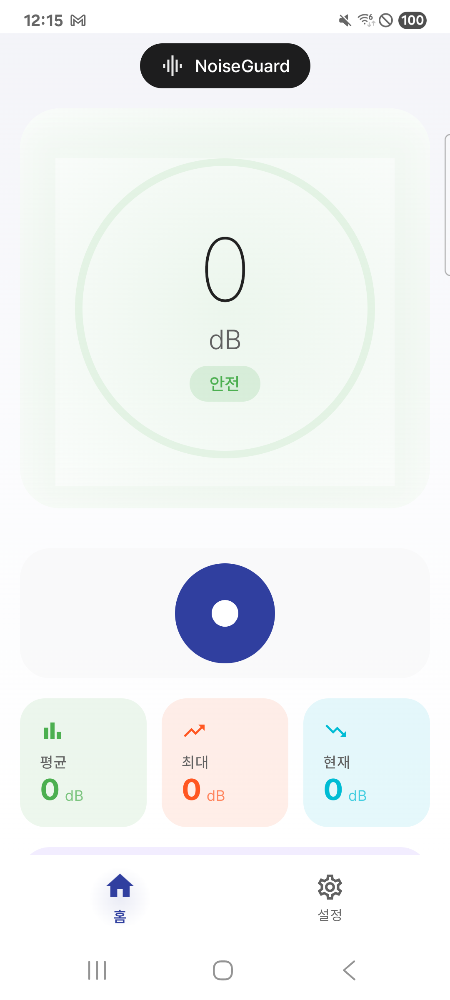
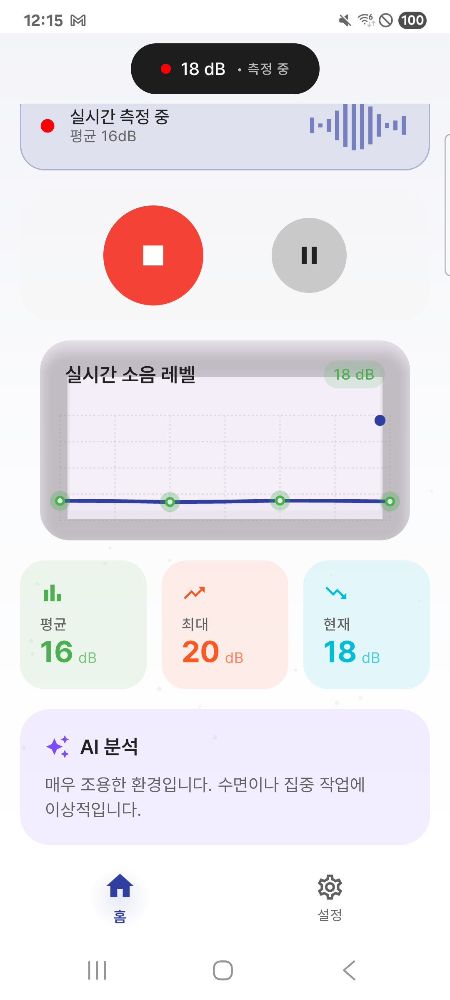
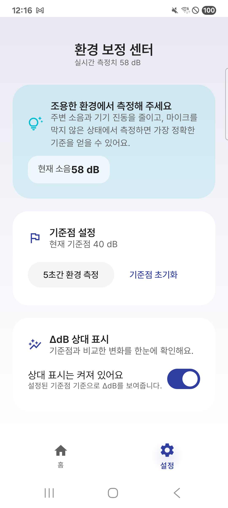
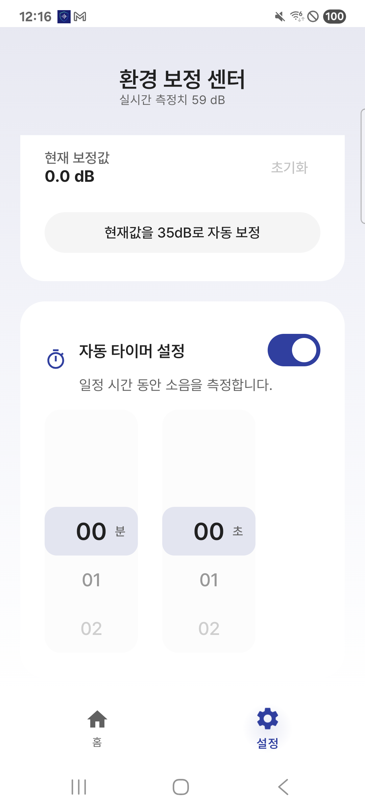
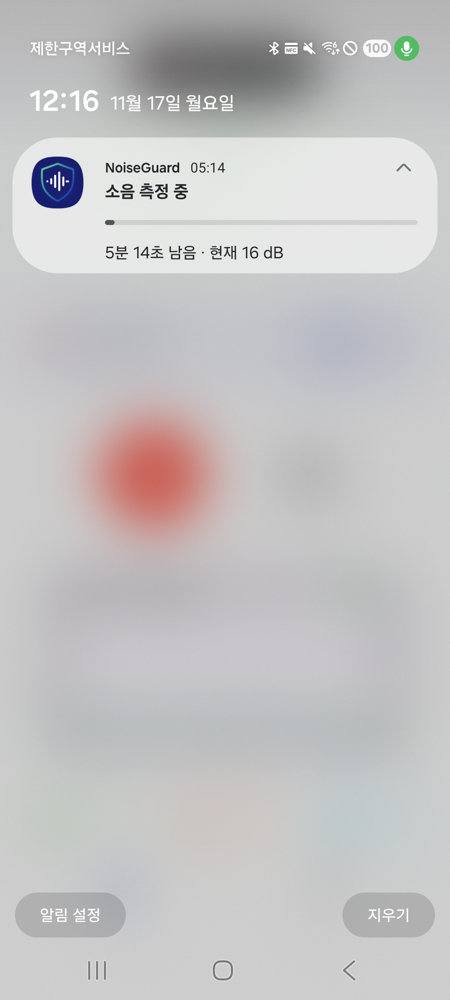
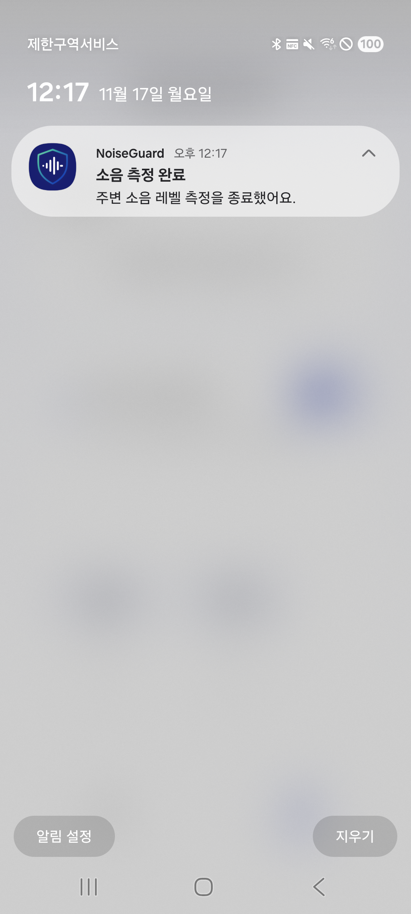

# 🔊 소음지킴이 (NoiseGuard)

**AI 기반 실시간 소음 측정 및 환경 보정 앱** 🎯

소음지킴이는 AI 기술로 환경별 소음을 정확하게 측정하고, 데시벨을 실시간으로 모니터링하는 스마트 소음 관리 앱입니다. Kotlin Multiplatform으로 개발되어 Android와 iOS 모두에서 일관된 사용자 경험을 제공합니다.

---

## 📱 앱 개요

- **플랫폼**: Android & iOS (Kotlin Multiplatform)
- **아키텍처**: MVVM + Clean Architecture + Koin DI
- **UI 프레임워크**: Jetpack Compose Multiplatform
- **주요 기능**:
  - 실시간 소음 측정 및 데시벨 시각화
  - AI 기반 환경별 소음 보정
  - 측정 타이머 및 알림 시스템
  - 측정 데이터 저장 및 관리
  - 실시간 오디오 파형 시각화

---

## 🎯 주요 기능

### 🎤 실시간 소음 측정
- **정확한 데시벨 측정**: 마이크를 통한 실시간 소음 레벨 측정
- **시각적 피드백**: 오디오 파형 및 차트를 통한 직관적인 시각화
- **측정 히스토리**: 과거 측정 데이터 저장 및 조회

### 🤖 AI 기반 환경 보정
- **스마트 보정**: AI가 측정 환경을 분석하여 자동 보정
- **환경별 최적화**: 실내, 실외, 도로변 등 다양한 환경에 대응
- **정확도 향상**: 환경 특성을 반영한 정밀한 소음 측정

### ⏱️ 스마트 타이머
- **맞춤형 측정 시간**: 원하는 시간만큼 소음 측정
- **백그라운드 측정**: 다른 작업 중에도 지속적인 모니터링
- **측정 완료 알림**: 설정한 시간이 되면 자동으로 알림

### 📊 데이터 시각화
- **실시간 그래프**: 소음 레벨의 변화를 실시간으로 확인
- **오디오 파형**: 소리의 파동을 시각적으로 표현
- **통계 정보**: 평균, 최대, 최소 데시벨 등 상세 정보 제공

### 🔔 알림 시스템
- **측정 중 알림**: 백그라운드에서도 측정 상태 확인
- **측정 완료 알림**: 타이머 종료 시 즉시 알림
- **맞춤형 설정**: 알림 스타일 및 시간 설정 가능

---

## 🛠 기술 스택

### 📱 Frontend (Android & iOS)
- **Kotlin Multiplatform**: 크로스플랫폼 개발
- **Jetpack Compose Multiplatform**: 선언형 UI 프레임워크
- **Koin**: 의존성 주입 (DI)
- **Navigation Compose**: 화면 이동 관리
- **SQLDelight**: 크로스플랫폼 데이터베이스
- **Kotlinx Coroutines**: 비동기 처리
- **Kotlinx Serialization**: JSON 직렬화
- **Kotlinx DateTime**: 날짜/시간 처리

### 🔧 Platform Specific

**Android:**
- **MediaPipe Tasks Audio**: AI 기반 오디오 분석
- **Android Wave Recorder**: 오디오 녹음 및 처리
- **MPAndroidChart**: 데이터 차트 시각화
- **WorkManager**: 백그라운드 작업 스케줄링
- **Compose Audio Waveform**: 오디오 파형 시각화
- **Material 3**: 디자인 시스템

**iOS:**
- **AVFoundation**: 오디오 녹음 및 처리
- **Core ML**: AI 기반 오디오 분석
- **User Notifications**: 로컬 알림
- **Charts**: 데이터 시각화
- **SwiftUI**: iOS 네이티브 UI 컴포넌트

### 🧠 AI/ML
- **MediaPipe Audio Tasks**: 실시간 오디오 분류 및 분석
- **TensorFlow Lite**: 온디바이스 머신러닝
- **환경 인식 모델**: 주변 환경 자동 감지

---

## ⚙️ 개발 & 빌드 환경

### 필수 요구사항
- **JDK 11+**
- **Android Studio Hedgehog 이상**
- **Xcode 15+ (iOS 개발 시)**
- **Gradle 8+**

### 최소 지원 버전
- **Android**: API 24 (Android 7.0) 이상
- **iOS**: iOS 15.0 이상

---

## 📂 프로젝트 구조

```
NoiseGuard/
├── composeApp/                    # 메인 KMP 모듈
│   ├── src/
│   │   ├── commonMain/           # 공통 코드 (비즈니스 로직)
│   │   │   ├── kotlin/
│   │   │   │   ├── core/         # 핵심 유틸리티
│   │   │   │   ├── data/         # 데이터 레이어
│   │   │   │   │   ├── database/ # SQLDelight DB
│   │   │   │   │   ├── model/    # 데이터 모델
│   │   │   │   │   └── repository/ # 리포지토리
│   │   │   │   ├── domain/       # 도메인 레이어
│   │   │   │   │   ├── model/    # 도메인 모델
│   │   │   │   │   └── usecase/  # 유즈케이스
│   │   │   │   ├── presentation/ # 프레젠테이션 레이어
│   │   │   │   │   ├── home/     # 홈 화면
│   │   │   │   │   ├── settings/ # 설정 화면
│   │   │   │   │   ├── history/  # 측정 기록
│   │   │   │   │   └── timer/    # 타이머 화면
│   │   │   │   └── notification/ # 알림 관리
│   │   │   └── composeResources/ # 공통 리소스
│   │   ├── androidMain/          # Android 전용 코드
│   │   │   └── kotlin/
│   │   │       ├── data/         # Android 구현체
│   │   │       │   └── audio/    # 오디오 녹음기
│   │   │       ├── service/      # 백그라운드 서비스
│   │   │       └── notification/ # 알림 구현
│   │   └── iosMain/              # iOS 전용 코드
│   │       └── kotlin/
│   │           ├── data/         # iOS 구현체
│   │           └── notification/ # 알림 구현
│   └── build.gradle.kts
├── iosApp/                       # iOS 앱 모듈
│   ├── iosApp/
│   │   ├── iOSApp.swift         # iOS 앱 진입점
│   │   ├── ContentView.swift    # 메인 SwiftUI 뷰
│   │   └── ML/                  # Core ML 모델
│   └── iosApp.xcodeproj/
├── gradle/
│   └── libs.versions.toml        # 의존성 버전 관리
└── build.gradle.kts
```

---

## 📸 스크린샷

### 메인 화면


실시간으로 소음 데시벨을 측정하고 시각화합니다.

### 실시간 소음 레벨 그래프


소음 레벨의 변화를 실시간 그래프로 확인할 수 있습니다.

### 환경 보정 센터


AI가 측정 환경을 분석하여 자동으로 소음을 보정합니다.

### 타이머 설정


원하는 시간만큼 소음을 측정할 수 있습니다.

### 측정 중 알림


백그라운드에서도 측정 상태를 확인할 수 있습니다.

### 측정 완료 알림


타이머가 종료되면 자동으로 알림을 보냅니다.

---

## 🏗️ 아키텍처

### Clean Architecture
```
Presentation Layer (UI)
        ↓
Domain Layer (Business Logic)
        ↓
Data Layer (Database, Audio)
```

### MVVM 패턴
- **View**: Jetpack Compose UI
- **ViewModel**: 상태 관리 및 비즈니스 로직
- **Model**: 데이터 모델 및 리포지토리

### 의존성 주입
- **Koin**: 경량 DI 프레임워크 사용
- **모듈화**: 기능별로 분리된 Koin 모듈

---

## 🔐 권한

### Android
- `RECORD_AUDIO`: 소음 측정을 위한 마이크 접근
- `POST_NOTIFICATIONS`: 측정 알림 표시
- `FOREGROUND_SERVICE`: 백그라운드 측정

### iOS
- `NSMicrophoneUsageDescription`: 마이크 접근
- `NSUserNotificationsUsageDescription`: 알림 표시

---

## 📈 향후 개선 계획

- **🗺️ 소음 지도**: 위치 기반 소음 데이터 공유
- **📊 장기 통계**: 일/주/월 단위 소음 추이 분석
- **🌍 다국어 지원**: 영어, 중국어, 일본어 추가
- **☁️ 클라우드 동기화**: 다중 기기 간 데이터 동기화
- **⌚ Watch 앱**: Apple Watch/Wear OS 지원
- **🔗 소셜 공유**: 측정 결과 SNS 공유 기능
- **🎨 테마 커스터마이징**: 더 다양한 UI 테마 지원

---

## 👩‍💻 개발자

- **신가영** ([GitHub](https://github.com/gay00ung))
- **이메일**: gayoung990911@gmail.com
- **블로그**: [Velog](https://velog.io/@tlsrkdud0911/posts)

---

## 📦 다운로드

<a href="https://play.google.com/store/apps/details?id=net.lateinit.noiseguard">
  
</a>

> 본 앱은 실제 배포용으로 개발되어 [Google Play 스토어](https://play.google.com/store/apps/details?id=net.lateinit.noiseguard)에 정식 출시되었습니다.
> 
> 곧 App Store에서도 만나보실 수 있습니다! 🍎

---

## 📄 라이선스

이 프로젝트는 Apache License 2.0 하에 배포됩니다. 자세한 내용은 [LICENSE](LICENSE) 파일을 참조하세요.

---

## 📞 문의 및 지원

문제가 발생했거나 제안사항이 있으신가요?

- **Issues**: [GitHub Issues](https://github.com/gay00ung/NoiseGuard/issues)
- **Email**: gayoung990911@gmail.com

---

## 🙏 감사의 말

이 프로젝트는 다음 오픈소스 라이브러리들의 도움으로 개발되었습니다:

- [Kotlin Multiplatform](https://kotlinlang.org/docs/multiplatform.html)
- [Jetpack Compose](https://developer.android.com/jetpack/compose)
- [Koin](https://insert-koin.io/)
- [SQLDelight](https://cashapp.github.io/sqldelight/)
- [MediaPipe](https://developers.google.com/mediapipe)
- [MPAndroidChart](https://github.com/PhilJay/MPAndroidChart)

---

<div align="center">

**소음 데시벨을 실시간 측정하고, 환경에 맞춰 AI가 자동으로 보정까지!**  
**스마트한 소음 관리의 시작, 소음지킴이와 함께하세요.** 🎯

Made with ❤️ by [신가영](https://github.com/gay00ung)

</div>
